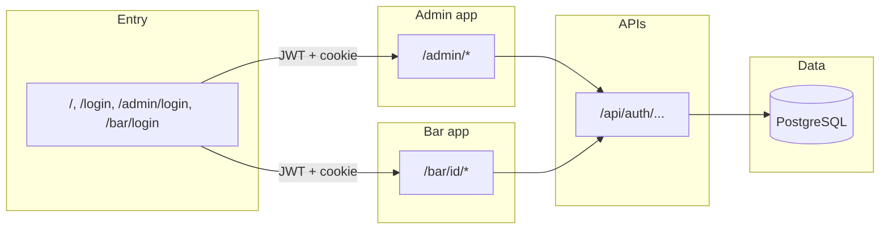

# Hoppr Business

Web app for **platform administrators** and **bar staff**: manage venues, staff, CSV imports, promotions, VIP passes, QR scanning, and analytics-style dashboards. Built with **Next.js (App Router)**, **React**, **Prisma**, and **PostgreSQL**.

## Stack

- **Framework:** Next.js 16, React 19, TypeScript  
- **UI:** styled-components, lucide-react, react-hot-toast  
- **Data:** Prisma → PostgreSQL  
- **Auth:** JWT (`jsonwebtoken`) + bcrypt passwords; session cookie `hoppr_token` for server layouts  
- **Other:** html5-qrcode (scanner), papaparse / csv-parse (imports)

## Getting started

Install dependencies and set environment variables (at minimum):

- `DATABASE_URL` — PostgreSQL connection string (see `prisma/schema.prisma`)  
- `JWT_SECRET` — secret used to sign and verify JWTs (`src/lib/auth.ts`)

```bash
npm install
npx prisma db push   # or your migration workflow
npm run db:seed      # optional: seed data (see prisma/seed.ts)
npm run dev
```

Open [http://localhost:3000](http://localhost:3000).

### Useful scripts

| Script | Purpose |
|--------|--------|
| `npm run dev` | Development server |
| `npm run build` / `npm start` | Production build and run |
| `npm run db:push` | Push schema to the database |
| `npm run db:studio` | Prisma Studio |
| `npm run db:seed` | Run seed script |
| `npm run db:reset` | Reset DB and re-seed |

---

## Architecture overview

The app has **two authenticated products** sharing one codebase:

1. **Admin** — internal operators (`AdminUser` in the database).  
2. **Bar portal** — staff tied to a single `Bar` (`BarStaff`).

Unauthenticated users land on **login**. After login, the client stores the JWT (commonly for `Authorization: Bearer` API calls). **Server-rendered areas** also expect an HTTP cookie named **`hoppr_token`** so layouts can validate the session on each request.



### Authentication flow

1. User submits credentials to **`POST /api/auth/admin`** or **`POST /api/auth/bar`**.  
2. **`AuthService`** (`src/services/auth-service.ts`) checks the password against Prisma and returns a **JWT**.  
3. The **admin layout** (`src/app/admin/layout.tsx`) or **bar layout** (`src/app/bar/layout.tsx`) reads **`hoppr_token`**, calls **`authService.validateToken`**, and **redirects to `/login`** if the token is missing, invalid, or the wrong role (admin vs bar staff).  
4. Most **JSON APIs** expect **`Authorization: Bearer <token>`** and re-verify the JWT (and often the user row in the database) before mutating data.

Bar routes under **`/bar/[id]/…`** often **also** assert that the logged-in staff member’s `barId` matches **`[id]`**, so staff cannot open another venue’s URLs.

### Data model (short)

Defined in `prisma/schema.prisma`: **AdminUser**, **Bar**, **BarStaff**, **BarPromotion**, **VIPPass**, **VIPPassScan**, **AuditLog**, **BarImport** (plus enums for roles, bar types, statuses, etc.).

---

## Pages and what they do

| Path | Audience | Description |
|------|----------|-------------|
| `/`, `/login` | Public | Dual login portal (switch between admin and bar staff). |
| `/admin/login` | Public | Admin-only login screen. |
| `/bar/login` | Public | Bar staff login (optional bar context). |
| `/admin/dashboard` | Admin | High-level KPI-style dashboard. |
| `/admin/bars` | Admin | Searchable list of bars (backed by admin bars API). |
| `/admin/bars/create` | Admin | Form to create a bar manually. |
| `/admin/bars/import` | Admin | CSV import UI for bulk bars. |
| `/admin/bars/[id]` | Admin | Detail view for one bar. |
| `/admin/bars/[id]/edit` | Admin | Edit an existing bar. |
| `/admin/analytics` | Admin | Multi-section analytics workspace (see note below). |
| `/admin/users` | Admin | Manage platform admin users. |
| `/bar/[id]/dashboard` | Bar staff | Venue home dashboard. |
| `/bar/[id]/promotions` | Bar staff | Promotions workflow UI. |
| `/bar/[id]/scanner` | Bar staff | QR scanner (e.g. VIP pass flows). |
| `/bar/[id]/analytics` | Bar staff | Bar-level analytics charts. |
| `/bar/[id]/intelligence` | Bar staff | Intelligence / insights hub for the venue. |
| `/bar/[id]/users` | Bar staff | Manage staff for that bar. |


---

## API routes (summary)

All live under **`src/app/api/auth/`**:

| Methods | Path | Role |
|--------|------|------|
| `POST` | `/api/auth/admin` | Admin login |
| `POST` | `/api/auth/bar` | Bar staff login |
| `GET`, `POST` | `/api/auth/admin/bars` | List / create bars |
| `GET`, `PUT`, `DELETE` | `/api/auth/admin/bars/[id]` | Read / update / delete one bar |
| `POST` | `/api/auth/admin/bars/import` | CSV import |
| `GET` | `/api/auth/admin/bars/import/history` | Import history |
| `GET`, `POST`, `PUT`, `DELETE` | `/api/auth/admin/users` | Admin user CRUD |
| `GET` | `/api/auth/admin/analytics` | Stub (503) |
| `GET`, `POST`, `PUT`, `DELETE` | `/api/auth/bar/[barId]/staff` | Bar staff CRUD for a venue |

---

## Project layout (where to look)

| Path | Role |
|------|------|
| `src/app/` | Routes, layouts, and Route Handlers |
| `src/components/admin/` | Admin UI |
| `src/components/bar/` | Bar portal UI |
| `src/components/auth/` | Login components |
| `src/components/shared/` | Shared navigation, charts, UI primitives |
| `src/lib/auth.ts` | JWT and password helpers |
| `src/lib/database.ts` | Shared Prisma client singleton |
| `src/services/auth-service.ts` | Login and token validation |
| `prisma/` | Schema and seed |

---

## Deploy

You can deploy like any Next.js app (for example [Vercel](https://vercel.com)). Ensure production **`DATABASE_URL`**, **`JWT_SECRET`**, and secure cookie settings match your hosting environment.
